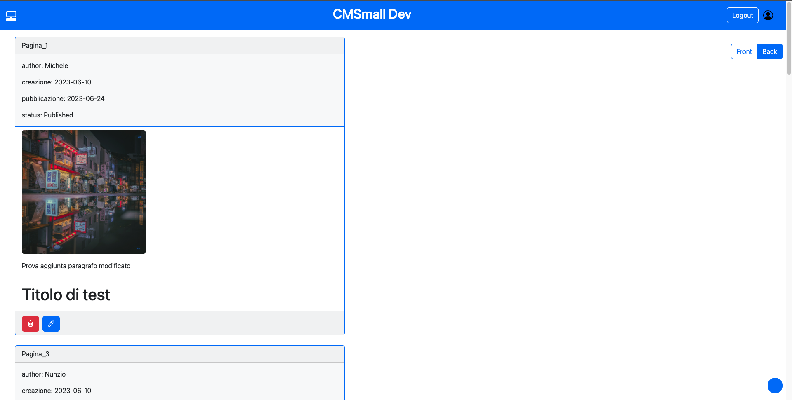
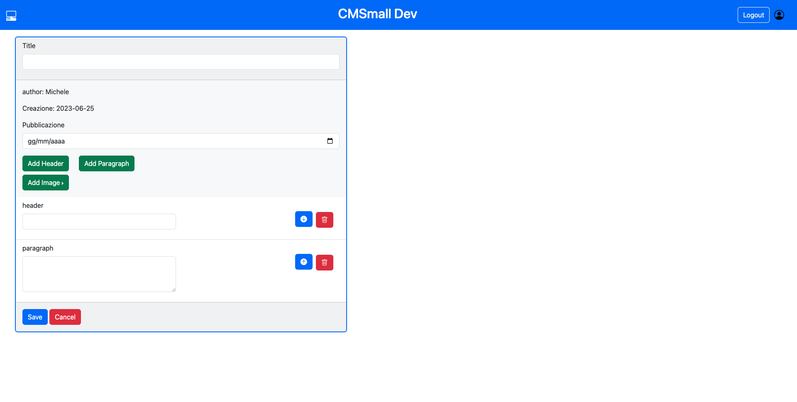

# Exam #1: "CMSmall"
## Student: s309063 VIOLA RAFFAELE 

## React Client Application Routes

- Route `/`: Pagina principale che mostra il front-office quando l'utente NON è autenticato
- Route `/filter/:Front`: Pagina principale che mostra il front-office quando l'utente è autenticato
- Route `/filter/:Back`: Pagina principale che mostra il back-office quando l'utente è autenticato
- Route `/add`: Pagina con un form con cui si può creare una nuova pagina
- Route `/edit/:id`: Pagina con un form con cui si può modificare la pagina con id pari al parametro passato
- Route `/login`: Pagina in cui si effetttua il login
- Route `*`: Pagina di default quando la route non ha altri match

## API Server

### Autenticazione
- POST `/api/sessions`
  - {"username": "some", "password": "some"}??
  - response body content: {id:x, email: x, name: x, role: User/Admin}
- GET `/api/sessions/current`
  - response body content: {id:x, email: x, name: x, role: User/Admin}
- DELETE `/api/sessions/current`

### Altre
- GET `/api/pages/front`

  - Non autenticata, Ritorna le pagine del front-office, quindi tutte le pagine "pubblicate" già in ordine cronologico

  - response body content:

    [ {

    "id": 16,

    "title": "Viaggio a Tokyo",

    "authorID": 1,

    "author": "Michele",

    "creazione": "2023-06-23",

    "pubblicazione": "2023-06-07",

    "blocks": [

       { "id": 136, "type": "image", "value": "image2.jpg", "position": 1},

       ...,{...}
      
    ]

    },... ]

  
- GET `/api/pages/back`

  - Autenticata, Ritorna le pagine del back-office, quindi tutte le pagine create da tutti gli utenti

  - response body content:

  [ {

    "id": 16,

    "title": "Viaggio a Tokyo",

    "authorID": 1,

    "author": "Michele",

    "creazione": "2023-06-23",

    "pubblicazione": "2023-06-07",

    "blocks": [

    { "id": 136, "type": "image", "value": "image2.jpg","position": 1}
      
    ]

    } ]

- GET `/api/pages/:id`

  - Autenticata, Ritorna la pagina il cui id è pari a quello specificato come parametro, previa verifica dei diritti come autore/Admin

  - request parameters and request body content:

    - id: number

  - response body content:

    {

    "id": x,

    "title": "Viaggio a Tokyo",

    "authorID": "x",

    "author": "Michele",

    "creazione": "2023-06-23",

    "pubblicazione": "2023-06-07",

    "blocks": [

       { "id": 136, "type": "image", "value": "image2.jpg", "position": 1}
      
    ]

    }

- POST `/api/pages`
  - Autenticata, Crea una nuova pagina nel db
  - request parameters and request body content:

  {

  title: 'pppp',

  author: id, //id number

  creazione: '2023-06-25',

  pubblicazione: '2023-06-08',

  blocks: [

    { type: 'image', value: 'image5.jpg', position: 1, created: true },

    { type: 'header', value: 'hhh', position: 2, created: true },

    { type: 'paragraph', value: 'ppppp', position: 3, created: true }

  ]

}

  - response body content

    La pagina appena creata in formato uguale all'API GET `/api/pages/:id`

- PUT `/api/pages/:id`
  - Autenticata, Modifica la pagina con id pari a quello specificato come parametro
  - request parameters and request body content:
  
    param id: number

  {

    id: x.

    title: 'pppp',

    author: x, //id number

    creazione: '2023-06-25',

    pubblicazione: '2023-06-08',

    blocks: [

    { type: 'image', value: 'image5.jpg', position: 1, created: true },

    { id: x,  type: 'header', value: 'hhh', position: 2},

    { id: x, deleted: true }

    ]

  }
    
  - response body content

    La pagina appena modificata in formato uguale all'API GET `/api/pages/:id`

- DELETE `/api/pages/:id`
  - Autenticata, Elimina la pagina con id pari a quello passato come parametro

- GET `/api/titles`
  - Non autenticata, Ritorna il titolo della web app
  - response body content

    {title: "some"}

- PUT `/api/titles`
  - Autenticata (solo per Admin), modifica il titolo della web app
  - request parameters and request body content:

    {title: "newTitle"}
  - response body content

    {title: "some"}

- GET `/api/images`
  - Autenticata, Ritorna il nome (da usare nell' URL) delle immagini presenti nel back-end
  - response body content

    ["image1.jpg", ..., "imageN.jpg"]

- GET `/api/users`
  - Autenticata (solo Admin), Ritorna gli utenti del db
  - response body content

    [ {"id": x, "email": xxxx, "name": xxxx},...,{...} ]

## Database Tables

- Table `users` - id, email, password, salt, role, name -> store degli utenti
- Table `pages` - id, title, author, creazione, pubblicazione -> store delle pagine
- Table `blocks` - id, page, type, value, position -> store dei blocchi associati ad ogni pagina page
- Table `title` - id, title -> titolo della web app
- Table `images` - id, url -> lista url delle immagini

## Main React Components

- `PageList` (in `PageLayout.jsx`): lista delle pagine e bottoni per navigare da front/back e verso il form di modifica/aggiunta
- `PageForm` (in `PageForm.jsx`): Form per gestire aggiunta e modifica di pagine
- `Navigation` (in `Navigation.jsx`): Navbar tramite cui navigare verso il login e/o cambiare il titolo della pagina per Admin
- `LoginForm` (in `Auth.jsx`): Form per effettuare il login

(only _main_ components, minor ones may be skipped)

## Screenshot

## Users Credentials

- user1@email.com, secure_password, Michele
- user2@email.com, secure_password, Nunzio
- user3@email.com, secure_password, Francesco
- user4@email.com, secure_password, Raffaele
- admin@email.com, secure_password, Gabriele

